# Mintellect - User Workflows Documentation

## 🎯 User Workflows Overview

This document provides comprehensive documentation for all user workflows and processes in the Mintellect project, focusing on step-by-step user journeys and interaction patterns.

### 📁 User Workflows Structure

```
User Workflows:
├── User Registration & Onboarding
├── Document Upload & Verification
├── Trust Score Generation
├── NFT Minting Process
├── Community Interaction
├── Settings & Profile Management
└── Troubleshooting & Support
```

---

## 👤 User Registration & Onboarding

### Workflow Overview
The user registration and onboarding process guides new users through account creation and platform familiarization.

### Step-by-Step Process

#### 1. Initial Landing Page Visit
```mermaid
graph TD
    A[User visits landing page] --> B[View features & benefits]
    B --> C[Click "Get Started" or "Sign Up"]
    C --> D[Registration form]
```

**User Actions:**
- Browse landing page content
- Review feature highlights
- Click call-to-action button

**System Responses:**
- Display feature overview
- Show pricing information
- Present registration options

#### 2. Account Registration
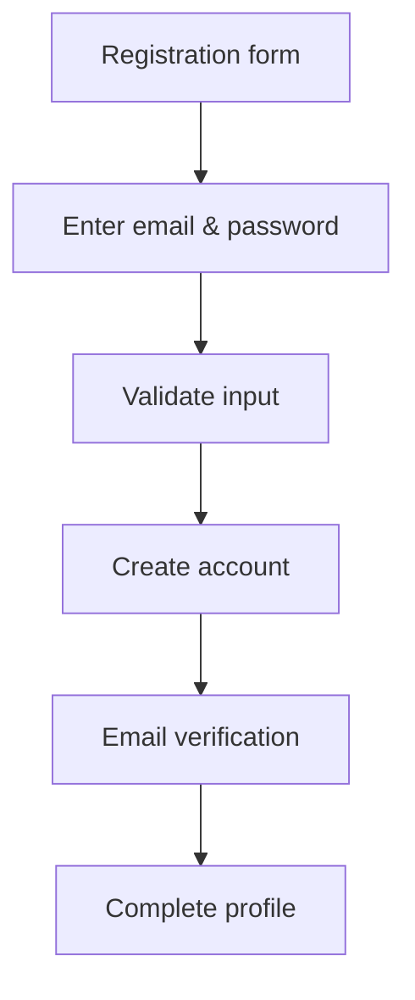

**Required Information:**
- Email address
- Password (minimum 8 characters)
- Full name
- Institution (optional)

**Validation Steps:**
- Email format validation
- Password strength check
- Duplicate email detection
- Terms of service acceptance

#### 3. Email Verification
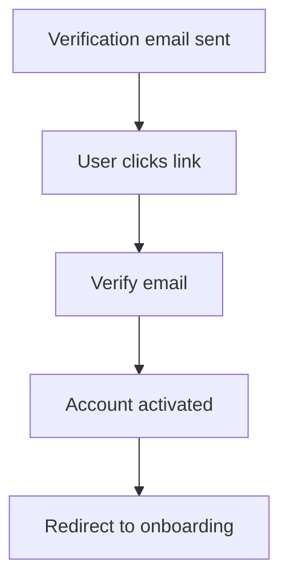

**Email Content:**
- Welcome message
- Verification link
- Platform introduction
- Support contact information

#### 4. Profile Completion
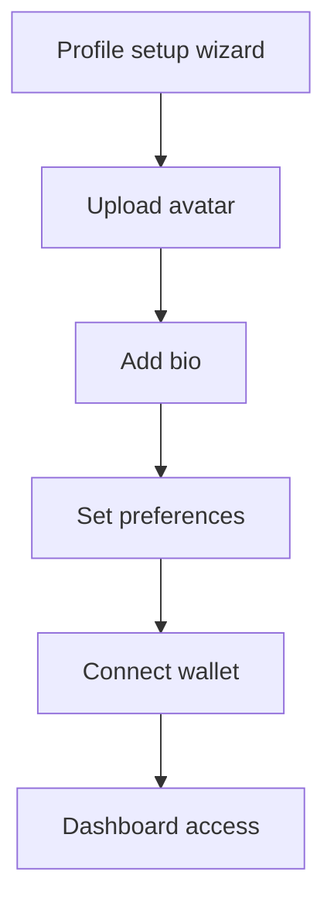

**Profile Elements:**
- Profile picture
- Bio and description
- Academic interests
- Notification preferences
- Privacy settings

### Onboarding Features

#### 1. Interactive Tutorial
```typescript
// Feature: Onboarding Tutorial
interface OnboardingStep {
  id: string;
  title: string;
  description: string;
  component: string;
  required: boolean;
  completed: boolean;
}

const onboardingSteps: OnboardingStep[] = [
  {
    id: "welcome",
    title: "Welcome to Mintellect",
    description: "Learn about our platform",
    component: "WelcomeTutorial",
    required: true,
    completed: false,
  },
  {
    id: "upload-document",
    title: "Upload Your First Document",
    description: "Try our document verification",
    component: "DocumentUploadTutorial",
    required: false,
    completed: false,
  },
  {
    id: "generate-trust-score",
    title: "Generate Trust Score",
    description: "See how trust scoring works",
    component: "TrustScoreTutorial",
    required: false,
    completed: false,
  },
];
```

#### 2. Progress Tracking
- **Completion Percentage**: Visual progress indicator
- **Step Navigation**: Skip or revisit steps
- **Achievement Badges**: Reward completion milestones
- **Help Resources**: Contextual assistance

#### 3. Guided Tours
- **Dashboard Tour**: Platform overview
- **Feature Highlights**: Key functionality introduction
- **Best Practices**: Usage recommendations
- **FAQ Integration**: Common questions addressed

---

## 📄 Document Upload & Verification

### Workflow Overview
The document upload and verification process allows users to submit academic documents for comprehensive analysis.

### Step-by-Step Process

#### 1. Document Upload
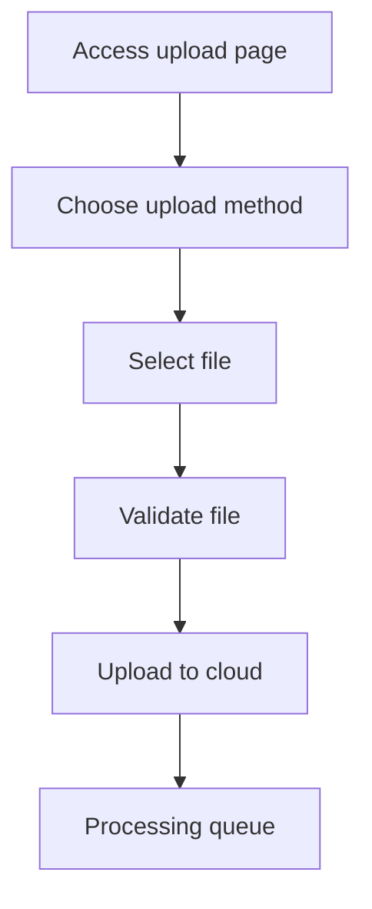

**Upload Methods:**
- Drag-and-drop interface
- File picker dialog
- URL import (for public documents)
- Camera capture (mobile)

**File Validation:**
- Format verification (PDF, DOC, DOCX)
- Size limit check (50MB maximum)
- Virus scanning
- Duplicate detection

#### 2. Processing Queue
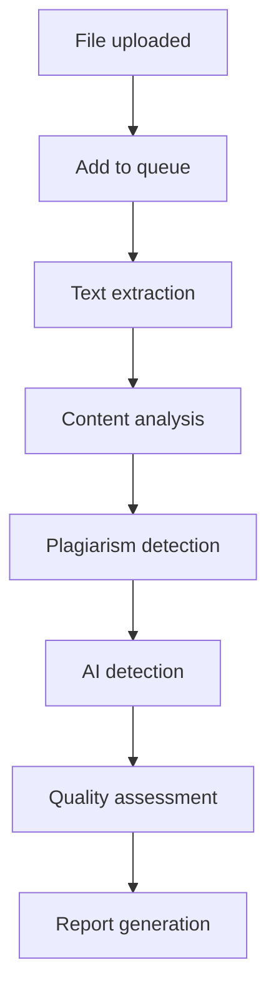

**Processing Stages:**
- **Text Extraction**: Extract text from document
- **Content Analysis**: Analyze document structure
- **Plagiarism Detection**: Check for similarities
- **AI Detection**: Identify AI-generated content
- **Quality Assessment**: Evaluate document quality
- **Report Generation**: Create comprehensive report

#### 3. Real-Time Progress
```typescript
// Feature: Processing Progress
interface ProcessingProgress {
  stage: string;
  percentage: number;
  estimatedTime: number;
  currentOperation: string;
  details: string;
}

const processingStages = [
  { name: "Upload", percentage: 10 },
  { name: "Text Extraction", percentage: 25 },
  { name: "Content Analysis", percentage: 40 },
  { name: "Plagiarism Detection", percentage: 60 },
  { name: "AI Detection", percentage: 75 },
  { name: "Quality Assessment", percentage: 90 },
  { name: "Report Generation", percentage: 100 },
];
```

#### 4. Results Review
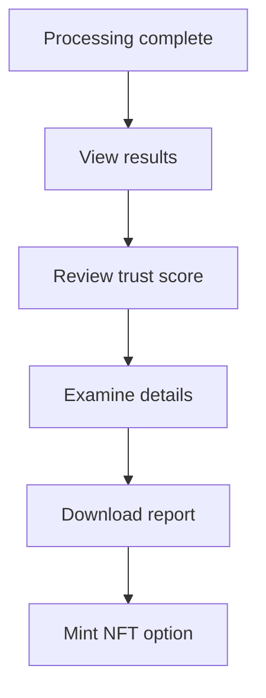

**Results Components:**
- Overall trust score
- Detailed breakdown by factor
- Plagiarism analysis results
- AI detection findings
- Quality metrics
- Recommendations

### User Interface Elements

#### 1. Upload Interface
```typescript
// Feature: Upload Interface
interface UploadInterface {
  dragDropZone: {
    active: boolean;
    accepted: boolean;
    rejected: boolean;
  };
  fileList: {
    files: File[];
    progress: number[];
    status: string[];
  };
  uploadButton: {
    disabled: boolean;
    text: string;
  };
}
```

#### 2. Progress Dashboard
- **Visual Progress Bar**: Real-time processing status
- **Stage Indicators**: Current processing stage
- **Time Estimates**: Remaining processing time
- **Cancel Option**: Stop processing if needed

#### 3. Results Display
- **Score Visualization**: Graphical trust score display
- **Detailed Breakdown**: Factor-by-factor analysis
- **Interactive Elements**: Expandable sections
- **Export Options**: Download reports in various formats

---

## 🛡️ Trust Score Generation

### Workflow Overview
The trust score generation process provides automated quality assessment and credibility scoring for academic documents.

### Step-by-Step Process

#### 1. Score Calculation
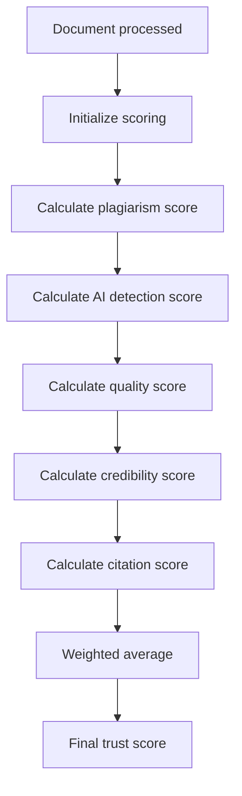

**Scoring Factors:**
- **Plagiarism (30%)**: Originality assessment
- **AI Detection (25%)**: Human vs AI content
- **Document Quality (20%)**: Writing quality
- **Source Credibility (15%)**: Reference quality
- **Citation Accuracy (10%)**: Citation verification

#### 2. Confidence Assessment
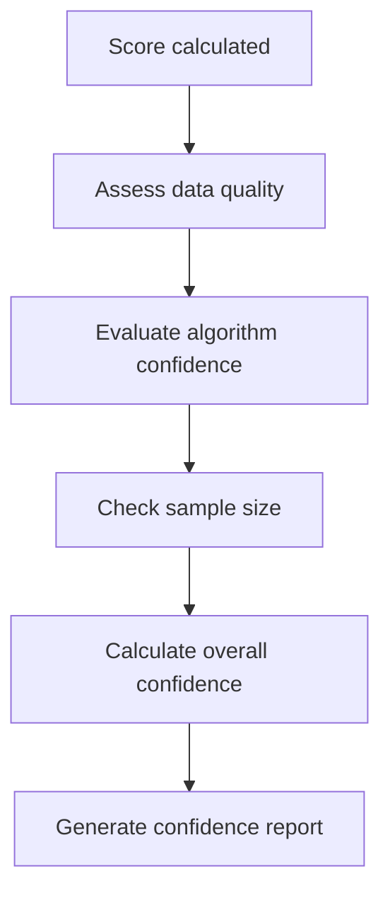

**Confidence Factors:**
- Data completeness
- Algorithm reliability
- Statistical significance
- Processing quality

#### 3. Report Generation
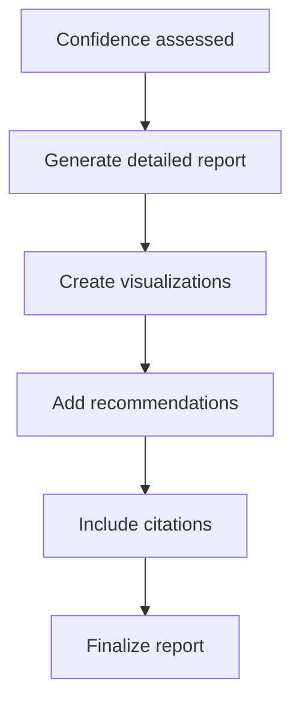

**Report Components:**
- Executive summary
- Detailed analysis
- Visual charts and graphs
- Specific recommendations
- Reference list
- Methodology explanation

### User Interaction Points

#### 1. Score Display
```typescript
// Feature: Trust Score Display
interface TrustScoreDisplay {
  overallScore: number;
  confidence: number;
  factors: {
    name: string;
    score: number;
    weight: number;
    details: string;
  }[];
  recommendations: string[];
  visualizations: Chart[];
}
```

#### 2. Detailed Analysis
- **Factor Breakdown**: Individual factor scores
- **Comparative Analysis**: Benchmark comparisons
- **Trend Analysis**: Historical score tracking
- **Peer Comparison**: Similar document analysis

#### 3. Recommendations
- **Improvement Suggestions**: Specific action items
- **Best Practices**: Academic writing guidelines
- **Resource Links**: Helpful external resources
- **Next Steps**: Suggested follow-up actions

---

## 🪙 NFT Minting Process

### Workflow Overview
The NFT minting process allows users to create blockchain-certified tokens representing their verified academic documents.

### Step-by-Step Process

#### 1. Verification Prerequisites
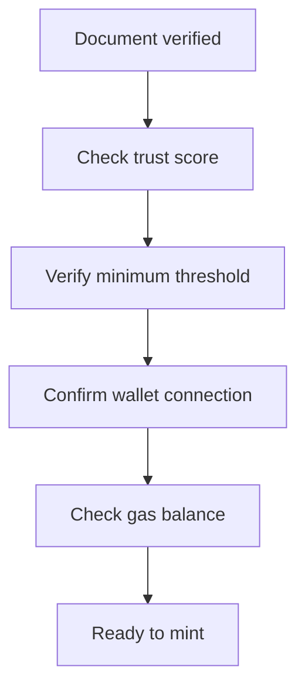

**Prerequisites:**
- Document must have trust score ≥ 70
- User wallet must be connected
- Sufficient gas balance for transaction
- Document verification completed

#### 2. Metadata Generation
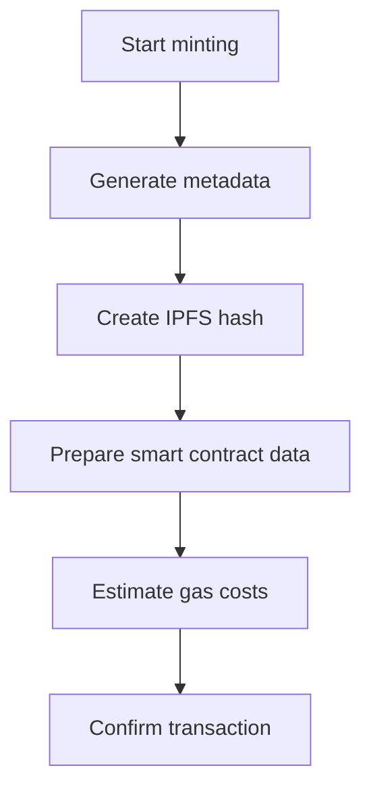

**Metadata Components:**
- Document title and author
- Trust score and verification date
- IPFS hash for document storage
- Verification certificate link
- Blockchain network information

#### 3. Smart Contract Interaction
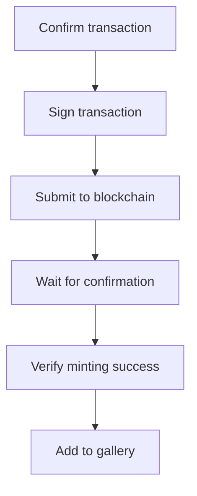

**Transaction Process:**
- User signs transaction with wallet
- Transaction submitted to blockchain
- Gas fees deducted from wallet
- NFT minted on smart contract
- Token ID assigned
- Metadata linked to token

#### 4. Gallery Integration
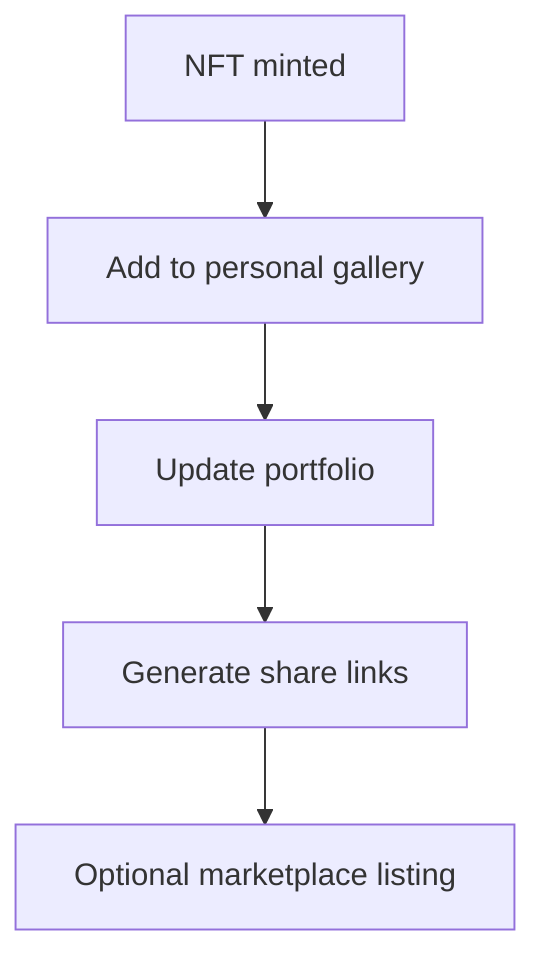

**Gallery Features:**
- Personal NFT collection
- Portfolio statistics
- Sharing capabilities
- Marketplace integration

### User Interface Elements

#### 1. Minting Interface
```typescript
// Feature: NFT Minting Interface
interface MintingInterface {
  prerequisites: {
    trustScore: number;
    walletConnected: boolean;
    gasBalance: number;
    allMet: boolean;
  };
  metadata: {
    title: string;
    author: string;
    trustScore: number;
    ipfsHash: string;
  };
  transaction: {
    gasEstimate: number;
    gasPrice: number;
    totalCost: number;
  };
}
```

#### 2. Transaction Status
- **Transaction Hash**: Blockchain transaction identifier
- **Confirmation Status**: Number of confirmations
- **Gas Used**: Actual gas consumed
- **Block Number**: Blockchain block containing transaction

#### 3. Gallery Management
- **NFT Display**: Visual representation of minted NFTs
- **Metadata View**: Detailed token information
- **Sharing Options**: Social media and link sharing
- **Portfolio Analytics**: Collection statistics and trends

---

## 👥 Community Interaction

### Workflow Overview
The community interaction process enables users to share, collaborate, and engage with the academic community.

### Step-by-Step Process

#### 1. Paper Sharing
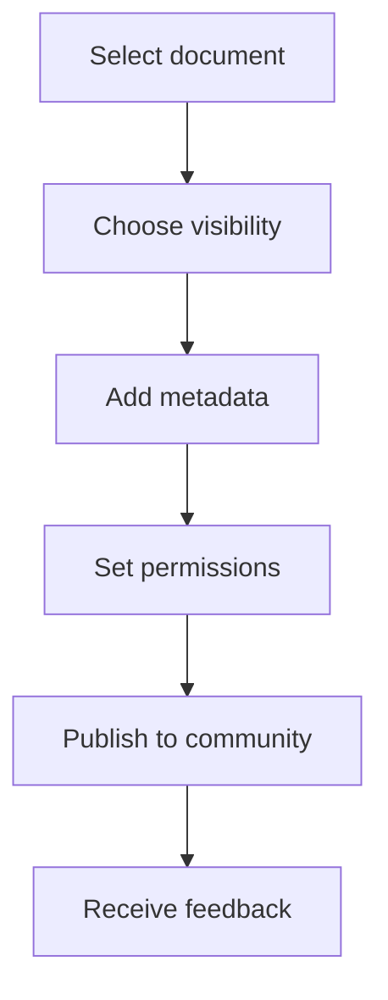

**Sharing Options:**
- **Public**: Visible to all community members
- **Private**: Only visible to author
- **Shared**: Visible to specific users or groups

**Metadata Requirements:**
- Title and abstract
- Keywords and tags
- Category and subject area
- Trust score and verification status

#### 2. Peer Review Process
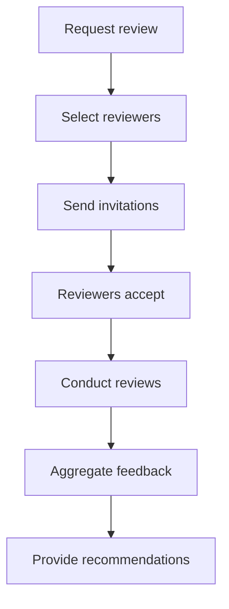

**Review Process:**
- Author requests peer review
- System suggests potential reviewers
- Reviewers receive invitations
- Reviews conducted using standardized forms
- Feedback aggregated and summarized
- Recommendations provided to author

#### 3. Discussion Participation
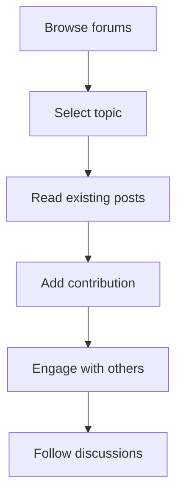

**Discussion Features:**
- Topic-based forums
- Threaded conversations
- Moderation tools
- Search and discovery
- Notification system

### Community Guidelines

#### 1. Academic Standards
- Maintain scholarly integrity
- Provide proper citations
- Respect intellectual property
- Engage in constructive dialogue

#### 2. Quality Requirements
- Minimum trust score for sharing
- Proper formatting and structure
- Clear and coherent writing
- Appropriate content for academic context

#### 3. Moderation Policies
- Community-driven moderation
- Clear violation guidelines
- Appeal process for decisions
- Transparent enforcement actions

---

## ⚙️ Settings & Profile Management

### Workflow Overview
The settings and profile management process allows users to customize their experience and manage their account information.

### Step-by-Step Process

#### 1. Profile Management
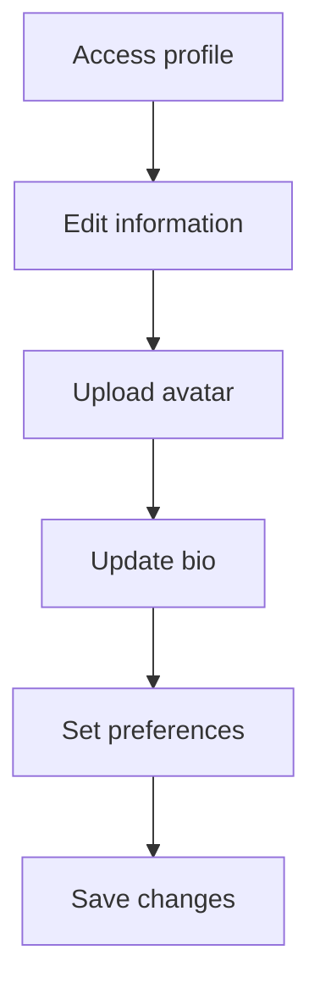

**Profile Elements:**
- Personal information
- Profile picture
- Bio and description
- Academic interests
- Professional affiliations

#### 2. Privacy Settings
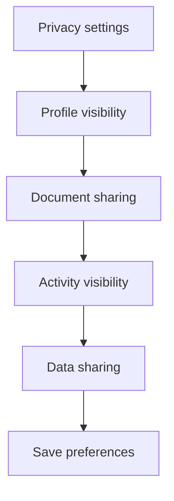

**Privacy Options:**
- Profile visibility settings
- Document sharing permissions
- Activity feed visibility
- Data usage preferences
- Third-party sharing controls

#### 3. Notification Preferences
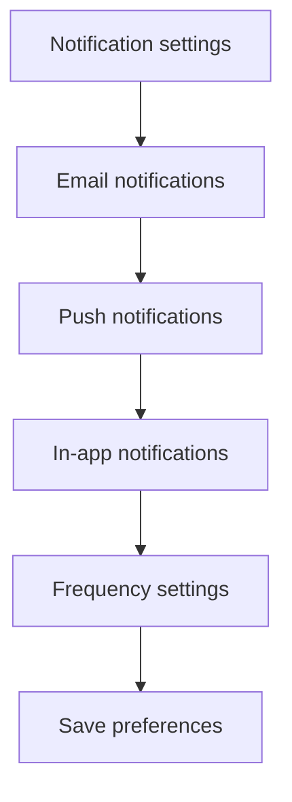

**Notification Types:**
- Document processing updates
- Trust score generation
- NFT minting confirmations
- Community interactions
- System announcements

#### 4. Security Settings
```mermaid
graph TD
    A[Security settings] --> B[Password change]
    B --> C[Two-factor authentication]
    C --> D[Session management]
    D --> E[Device management]
    E --> F[Security logs]
```

**Security Features:**
- Password management
- Two-factor authentication
- Active session monitoring
- Device authorization
- Security event logging

### User Interface Elements

#### 1. Settings Dashboard
```typescript
// Feature: Settings Dashboard
interface SettingsDashboard {
  sections: {
    profile: boolean;
    privacy: boolean;
    notifications: boolean;
    security: boolean;
    billing: boolean;
    integrations: boolean;
  };
  navigation: {
    currentSection: string;
    breadcrumbs: string[];
  };
}
```

#### 2. Profile Editor
- **Form Validation**: Real-time input validation
- **Image Upload**: Avatar upload with cropping
- **Auto-save**: Automatic saving of changes
- **Preview Mode**: Preview changes before saving

#### 3. Privacy Controls
- **Granular Permissions**: Detailed permission settings
- **Visual Indicators**: Clear privacy status indicators
- **Quick Actions**: Common privacy actions
- **Help Tooltips**: Contextual privacy guidance

---

## 🔧 Troubleshooting & Support

### Workflow Overview
The troubleshooting and support process helps users resolve issues and get assistance when needed.

### Step-by-Step Process

#### 1. Issue Identification
```mermaid
graph TD
    A[Encounter issue] --> B[Identify problem]
    B --> C[Check common solutions]
    C --> D[Search help center]
    D --> E[Contact support]
    E --> F[Issue resolution]
```

**Common Issues:**
- Upload failures
- Processing errors
- Wallet connection problems
- Payment issues
- Account access problems

#### 2. Self-Service Support
```mermaid
graph TD
    A[Help center] --> B[Browse categories]
    B --> C[Search articles]
    C --> D[Read solutions]
    D --> E[Follow steps]
    E --> F[Issue resolved]
```

**Self-Service Resources:**
- Comprehensive help center
- Step-by-step guides
- Video tutorials
- FAQ sections
- Troubleshooting wizards

#### 3. Support Ticket System
```mermaid
graph TD
    A[Create ticket] --> B[Describe issue]
    B --> C[Attach files]
    C --> D[Submit ticket]
    D --> E[Support response]
    E --> F[Issue resolution]
    F --> G[Ticket closure]
```

**Ticket Process:**
- Issue categorization
- Priority assignment
- Support agent assignment
- Response timeline
- Resolution tracking
- Satisfaction survey

### Support Features

#### 1. Help Center
```typescript
// Feature: Help Center
interface HelpCenter {
  categories: {
    gettingStarted: Article[];
    documentUpload: Article[];
    trustScores: Article[];
    nftMinting: Article[];
    troubleshooting: Article[];
  };
  search: {
    query: string;
    results: Article[];
    filters: Filter[];
  };
}
```

#### 2. Live Chat Support
- **Real-time Chat**: Instant messaging with support
- **File Sharing**: Share screenshots and documents
- **Chat History**: Persistent conversation records
- **Agent Escalation**: Transfer to specialized support

#### 3. Community Support
- **User Forums**: Peer-to-peer support
- **Knowledge Base**: Community-contributed articles
- **Best Practices**: User-generated tips and tricks
- **Success Stories**: User testimonials and case studies

---

*This user workflows documentation provides comprehensive coverage of all user interaction patterns in the Mintellect project. Each workflow is designed to provide a smooth, intuitive user experience while maintaining security and data integrity.* 