# Data Flow Architecture

This document provides a detailed overview of how data flows through the Mintellect system, including user interactions, document processing, and system integrations.

## 🔄 Overview

The Mintellect platform handles various types of data flows, from user authentication to complex document processing pipelines. Understanding these flows is crucial for system optimization, debugging, and feature development.

## 👤 User Authentication Flow

### Wallet-Based Authentication
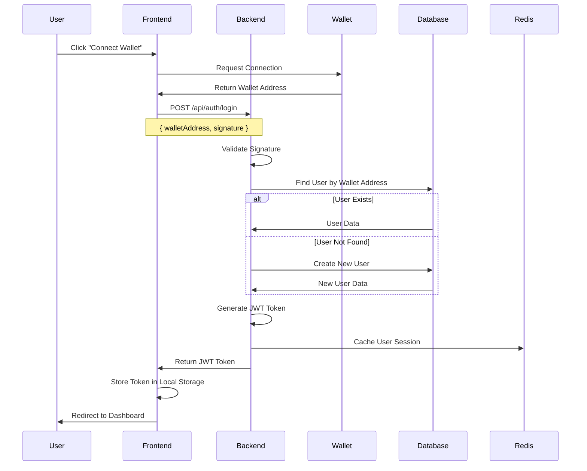
```mermaid
sequenceDiagram
    participant U as User
    participant F as Frontend
    participant B as Backend
    participant W as Wallet
    participant DB as Database
    participant R as Redis

    U->>F: Click "Connect Wallet"
    F->>W: Request Connection
    W->>F: Return Wallet Address
    F->>B: POST /api/auth/login
    Note over F,B: { walletAddress, signature }
    B->>B: Validate Signature
    B->>DB: Find User by Wallet Address
    alt User Exists
        DB->>B: User Data
    else User Not Found
        B->>DB: Create New User
        DB->>B: New User Data
    end
    B->>B: Generate JWT Token
    B->>R: Cache User Session
    B->>F: Return JWT Token
    F->>F: Store Token in Local Storage
    F->>U: Redirect to Dashboard
```

### Session Management
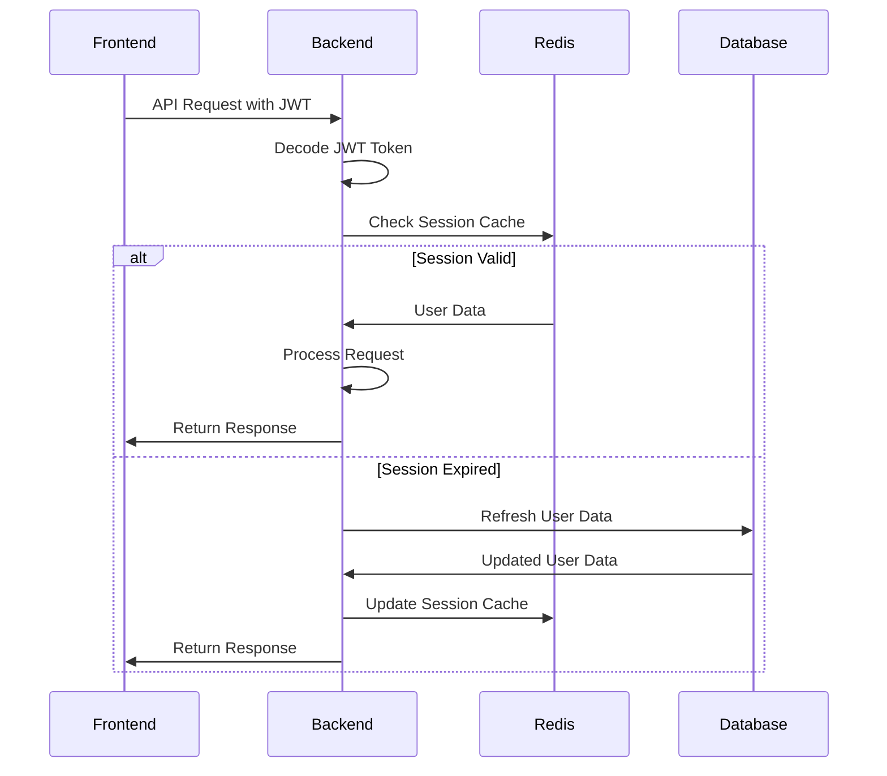
```mermaid
sequenceDiagram
    participant F as Frontend
    participant B as Backend
    participant R as Redis
    participant DB as Database

    F->>B: API Request with JWT
    B->>B: Decode JWT Token
    B->>R: Check Session Cache
    alt Session Valid
        R->>B: User Data
        B->>B: Process Request
        B->>F: Return Response
    else Session Expired
        B->>DB: Refresh User Data
        DB->>B: Updated User Data
        B->>R: Update Session Cache
        B->>F: Return Response
    end
```

## 📄 Document Processing Flow

### Document Upload Pipeline
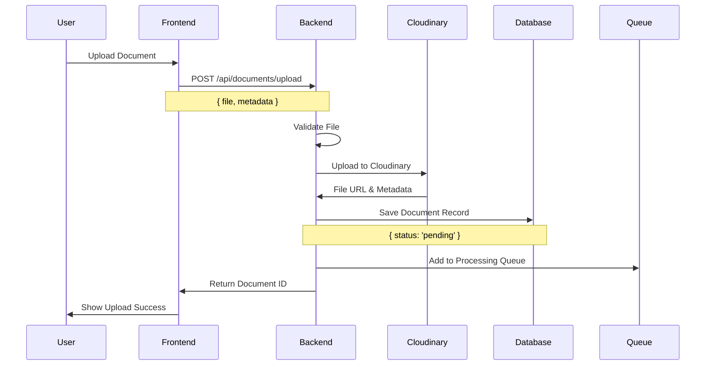
```mermaid
sequenceDiagram
    participant U as User
    participant F as Frontend
    participant B as Backend
    participant C as Cloudinary
    participant DB as Database
    participant Q as Queue

    U->>F: Upload Document
    F->>B: POST /api/documents/upload
    Note over F,B: { file, metadata }
    B->>B: Validate File
    B->>C: Upload to Cloudinary
    C->>B: File URL & Metadata
    B->>DB: Save Document Record
    Note over B,DB: { status: 'pending' }
    B->>Q: Add to Processing Queue
    B->>F: Return Document ID
    F->>U: Show Upload Success
```

### Document Analysis Pipeline
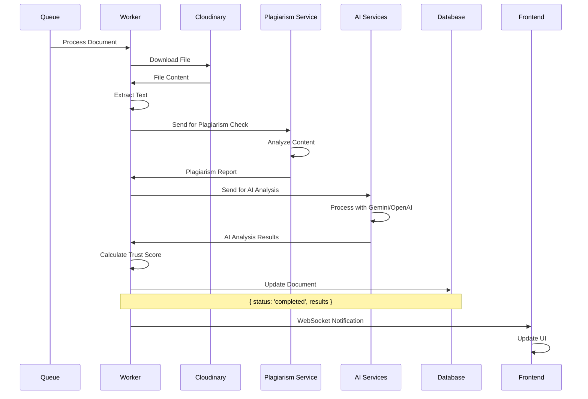
```mermaid
sequenceDiagram
    participant Q as Queue
    participant W as Worker
    participant C as Cloudinary
    participant P as Plagiarism Service
    participant AI as AI Services
    participant DB as Database
    participant F as Frontend

    Q->>W: Process Document
    W->>C: Download File
    C->>W: File Content
    W->>W: Extract Text
    W->>P: Send for Plagiarism Check
    P->>P: Analyze Content
    P->>W: Plagiarism Report
    W->>AI: Send for AI Analysis
    AI->>AI: Process with Gemini/OpenAI
    AI->>W: AI Analysis Results
    W->>W: Calculate Trust Score
    W->>DB: Update Document
    Note over W,DB: { status: 'completed', results }
    W->>F: WebSocket Notification
    F->>F: Update UI
```

### Trust Score Calculation Flow
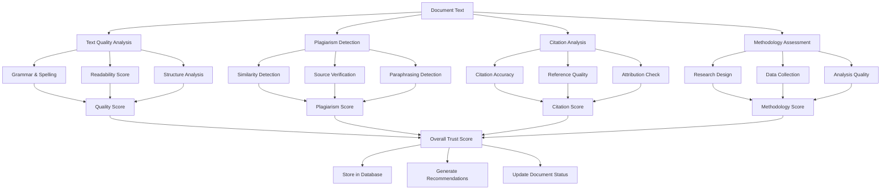
```mermaid
flowchart TD
    A[Document Text] --> B[Text Quality Analysis]
    A --> C[Plagiarism Detection]
    A --> D[Citation Analysis]
    A --> E[Methodology Assessment]
    
    B --> F[Grammar & Spelling]
    B --> G[Readability Score]
    B --> H[Structure Analysis]
    
    C --> I[Similarity Detection]
    C --> J[Source Verification]
    C --> K[Paraphrasing Detection]
    
    D --> L[Citation Accuracy]
    D --> M[Reference Quality]
    D --> N[Attribution Check]
    
    E --> O[Research Design]
    E --> P[Data Collection]
    E --> Q[Analysis Quality]
    
    F --> R[Quality Score]
    G --> R
    H --> R
    
    I --> S[Plagiarism Score]
    J --> S
    K --> S
    
    L --> T[Citation Score]
    M --> T
    N --> T
    
    O --> U[Methodology Score]
    P --> U
    Q --> U
    
    R --> V[Overall Trust Score]
    S --> V
    T --> V
    U --> V
    
    V --> W[Store in Database]
    V --> X[Generate Recommendations]
    V --> Y[Update Document Status]
```

## 🪙 NFT Minting Flow

### NFT Creation Process
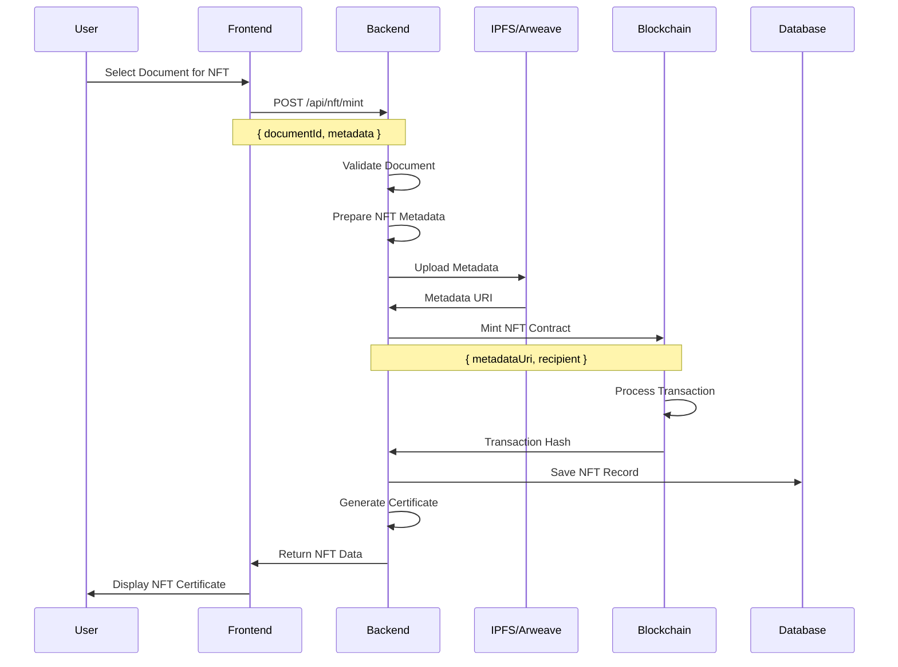
```mermaid
sequenceDiagram
    participant U as User
    participant F as Frontend
    participant B as Backend
    participant IPFS as IPFS/Arweave
    participant BC as Blockchain
    participant DB as Database

    U->>F: Select Document for NFT
    F->>B: POST /api/nft/mint
    Note over F,B: { documentId, metadata }
    B->>B: Validate Document
    B->>B: Prepare NFT Metadata
    B->>IPFS: Upload Metadata
    IPFS->>B: Metadata URI
    B->>BC: Mint NFT Contract
    Note over B,BC: { metadataUri, recipient }
    BC->>BC: Process Transaction
    BC->>B: Transaction Hash
    B->>DB: Save NFT Record
    B->>B: Generate Certificate
    B->>F: Return NFT Data
    F->>U: Display NFT Certificate
```

### NFT Verification Flow
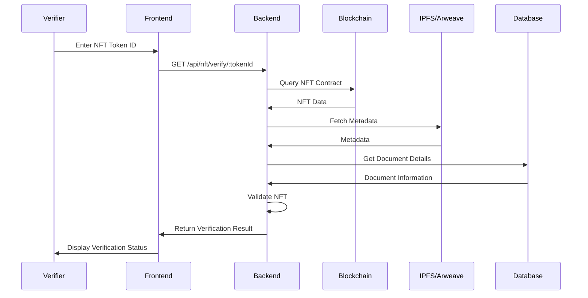
```mermaid
sequenceDiagram
    participant V as Verifier
    participant F as Frontend
    participant B as Backend
    participant BC as Blockchain
    participant IPFS as IPFS/Arweave
    participant DB as Database

    V->>F: Enter NFT Token ID
    F->>B: GET /api/nft/verify/:tokenId
    B->>BC: Query NFT Contract
    BC->>B: NFT Data
    B->>IPFS: Fetch Metadata
    IPFS->>B: Metadata
    B->>DB: Get Document Details
    DB->>B: Document Information
    B->>B: Validate NFT
    B->>F: Return Verification Result
    F->>V: Display Verification Status
```

## 🔄 Workflow Management Flow

### Workflow Orchestration
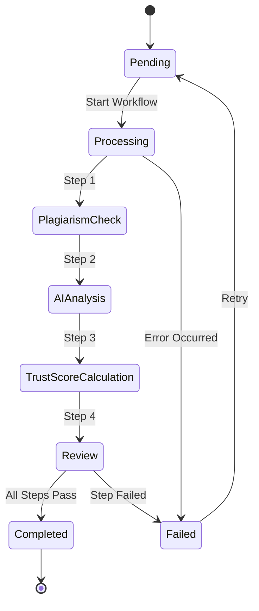
```mermaid
stateDiagram-v2
    [*] --> Pending
    Pending --> Processing: Start Workflow
    Processing --> PlagiarismCheck: Step 1
    PlagiarismCheck --> AIAnalysis: Step 2
    AIAnalysis --> TrustScoreCalculation: Step 3
    TrustScoreCalculation --> Review: Step 4
    Review --> Completed: All Steps Pass
    Review --> Failed: Step Failed
    Processing --> Failed: Error Occurred
    Failed --> Pending: Retry
    Completed --> [*]
```

### Workflow Step Execution
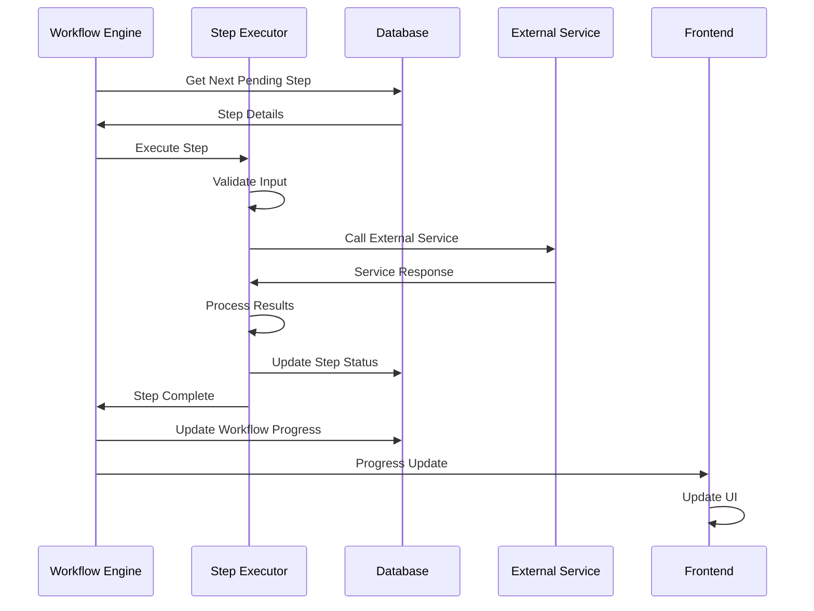
```mermaid
sequenceDiagram
    participant W as Workflow Engine
    participant S as Step Executor
    participant DB as Database
    participant ES as External Service
    participant F as Frontend

    W->>DB: Get Next Pending Step
    DB->>W: Step Details
    W->>S: Execute Step
    S->>S: Validate Input
    S->>ES: Call External Service
    ES->>S: Service Response
    S->>S: Process Results
    S->>DB: Update Step Status
    S->>W: Step Complete
    W->>DB: Update Workflow Progress
    W->>F: Progress Update
    F->>F: Update UI
```

## 📊 Analytics Data Flow

### User Analytics Collection
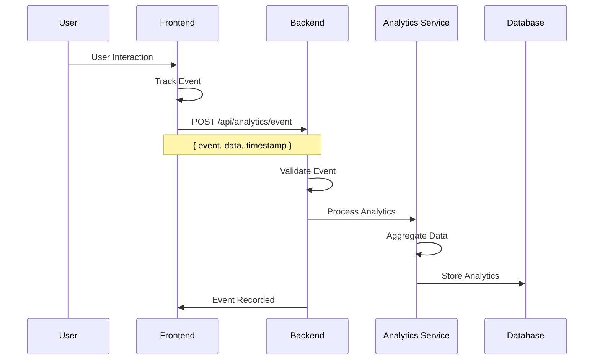
```mermaid
sequenceDiagram
    participant U as User
    participant F as Frontend
    participant B as Backend
    participant A as Analytics Service
    participant DB as Database

    U->>F: User Interaction
    F->>F: Track Event
    F->>B: POST /api/analytics/event
    Note over F,B: { event, data, timestamp }
    B->>B: Validate Event
    B->>A: Process Analytics
    A->>A: Aggregate Data
    A->>DB: Store Analytics
    B->>F: Event Recorded
```

### Real-time Analytics Dashboard
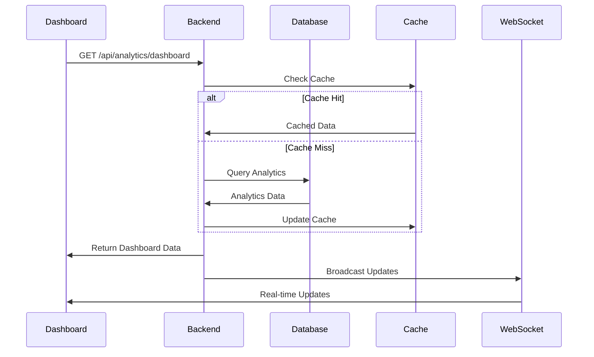
```mermaid
sequenceDiagram
    participant D as Dashboard
    participant B as Backend
    participant DB as Database
    participant C as Cache
    participant WS as WebSocket

    D->>B: GET /api/analytics/dashboard
    B->>C: Check Cache
    alt Cache Hit
        C->>B: Cached Data
    else Cache Miss
        B->>DB: Query Analytics
        DB->>B: Analytics Data
        B->>C: Update Cache
    end
    B->>D: Return Dashboard Data
    B->>WS: Broadcast Updates
    WS->>D: Real-time Updates
```

## 🔒 Security Data Flow

### Data Encryption Flow
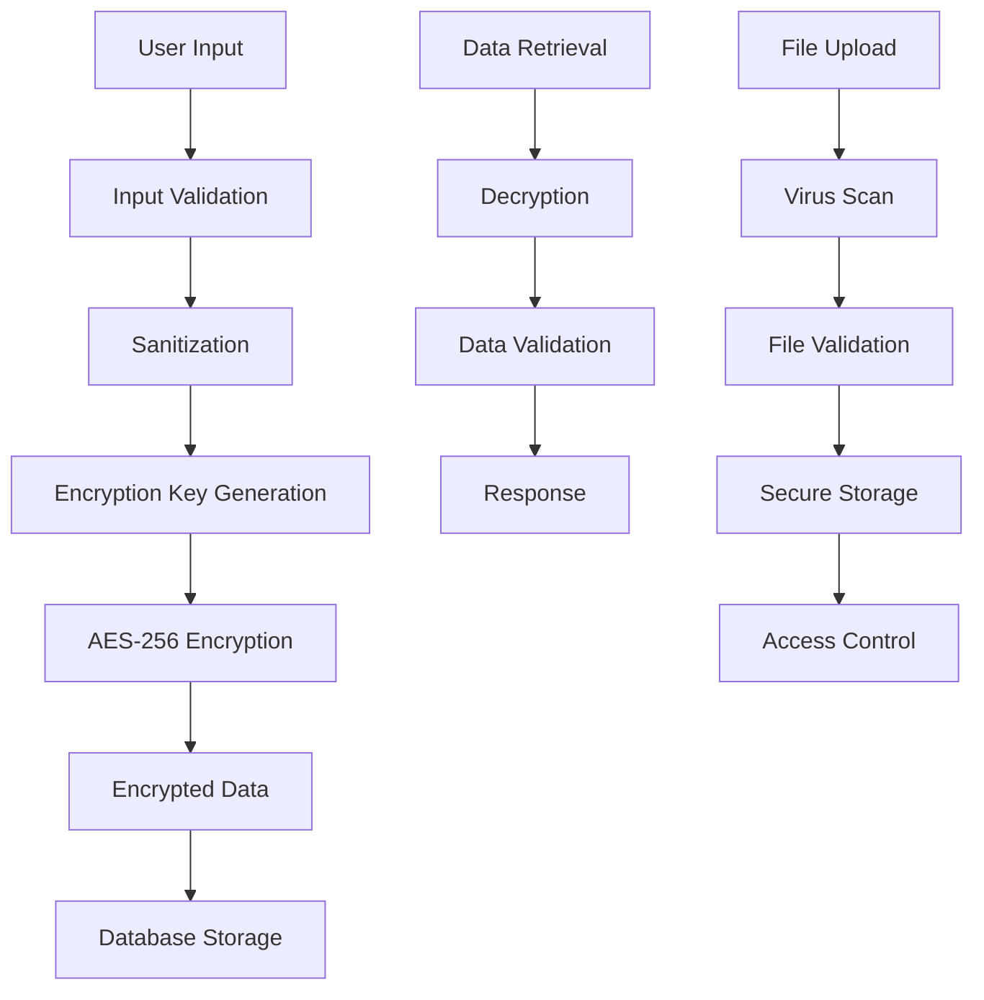
```mermaid
flowchart TD
    A[User Input] --> B[Input Validation]
    B --> C[Sanitization]
    C --> D[Encryption Key Generation]
    D --> E[AES-256 Encryption]
    E --> F[Encrypted Data]
    F --> G[Database Storage]
    
    H[Data Retrieval] --> I[Decryption]
    I --> J[Data Validation]
    J --> K[Response]
    
    L[File Upload] --> M[Virus Scan]
    M --> N[File Validation]
    N --> O[Secure Storage]
    O --> P[Access Control]
```

### Authentication Flow
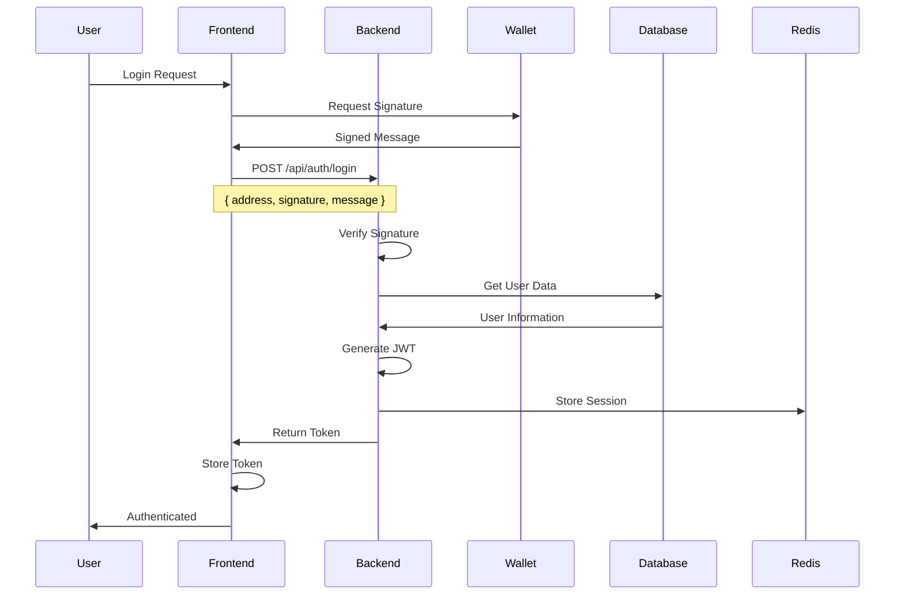
```mermaid
sequenceDiagram
    participant U as User
    participant F as Frontend
    participant B as Backend
    participant W as Wallet
    participant DB as Database
    participant R as Redis

    U->>F: Login Request
    F->>W: Request Signature
    W->>F: Signed Message
    F->>B: POST /api/auth/login
    Note over F,B: { address, signature, message }
    B->>B: Verify Signature
    B->>DB: Get User Data
    DB->>B: User Information
    B->>B: Generate JWT
    B->>R: Store Session
    B->>F: Return Token
    F->>F: Store Token
    F->>U: Authenticated
```

## 📈 Performance Data Flow

### Caching Strategy
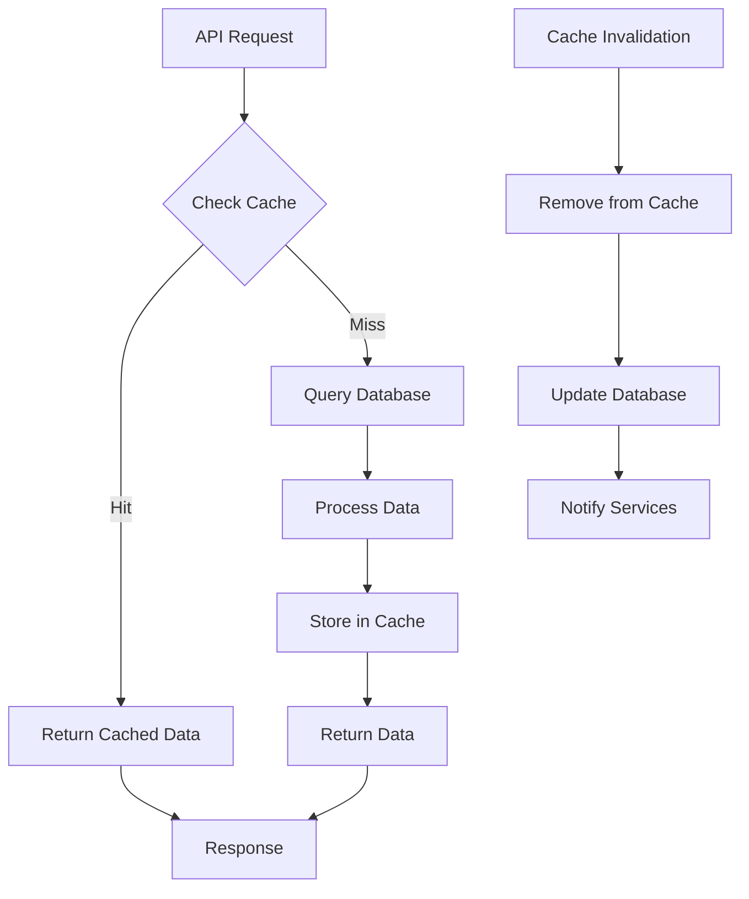
```mermaid
flowchart TD
    A[API Request] --> B{Check Cache}
    B -->|Hit| C[Return Cached Data]
    B -->|Miss| D[Query Database]
    D --> E[Process Data]
    E --> F[Store in Cache]
    F --> G[Return Data]
    C --> H[Response]
    G --> H
    
    I[Cache Invalidation] --> J[Remove from Cache]
    J --> K[Update Database]
    K --> L[Notify Services]
```

### Load Balancing Flow
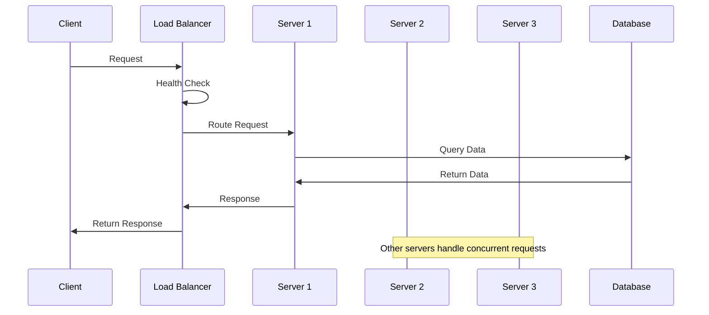
```mermaid
sequenceDiagram
    participant C as Client
    participant LB as Load Balancer
    participant S1 as Server 1
    participant S2 as Server 2
    participant S3 as Server 3
    participant DB as Database

    C->>LB: Request
    LB->>LB: Health Check
    LB->>S1: Route Request
    S1->>DB: Query Data
    DB->>S1: Return Data
    S1->>LB: Response
    LB->>C: Return Response
    
    Note over S2,S3: Other servers handle concurrent requests
```

## 🔄 Error Handling Flow

### Error Recovery Process
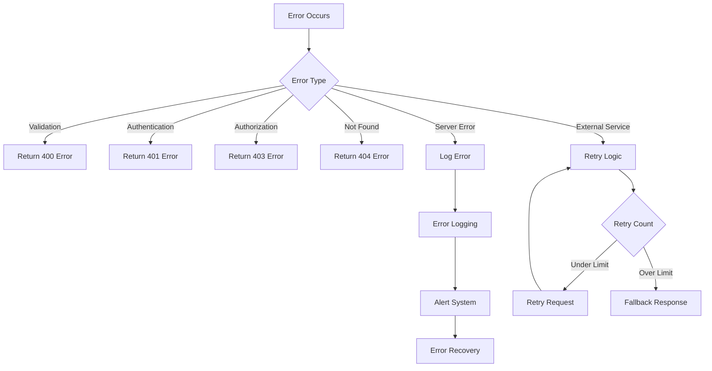
```mermaid
flowchart TD
    A[Error Occurs] --> B{Error Type}
    B -->|Validation| C[Return 400 Error]
    B -->|Authentication| D[Return 401 Error]
    B -->|Authorization| E[Return 403 Error]
    B -->|Not Found| F[Return 404 Error]
    B -->|Server Error| G[Log Error]
    B -->|External Service| H[Retry Logic]
    
    G --> I[Error Logging]
    I --> J[Alert System]
    J --> K[Error Recovery]
    
    H --> L{Retry Count}
    L -->|Under Limit| M[Retry Request]
    L -->|Over Limit| N[Fallback Response]
    M --> H
```

### Circuit Breaker Pattern
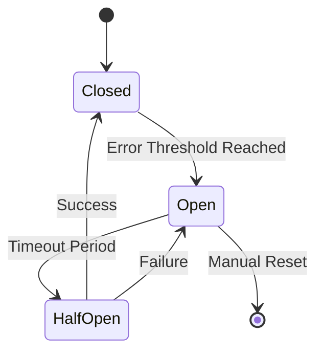
```mermaid
stateDiagram-v2
    [*] --> Closed
    Closed --> Open: Error Threshold Reached
    Open --> HalfOpen: Timeout Period
    HalfOpen --> Closed: Success
    HalfOpen --> Open: Failure
    Open --> [*]: Manual Reset
```

## 📊 Data Storage Flow

### Database Operations
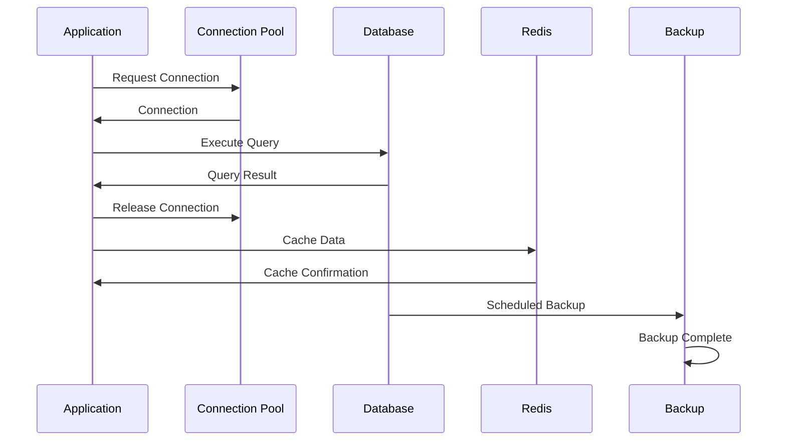
```mermaid
sequenceDiagram
    participant A as Application
    participant C as Connection Pool
    participant DB as Database
    participant R as Redis
    participant B as Backup

    A->>C: Request Connection
    C->>A: Connection
    A->>DB: Execute Query
    DB->>A: Query Result
    A->>C: Release Connection
    
    A->>R: Cache Data
    R->>A: Cache Confirmation
    
    DB->>B: Scheduled Backup
    B->>B: Backup Complete
```

### File Storage Flow
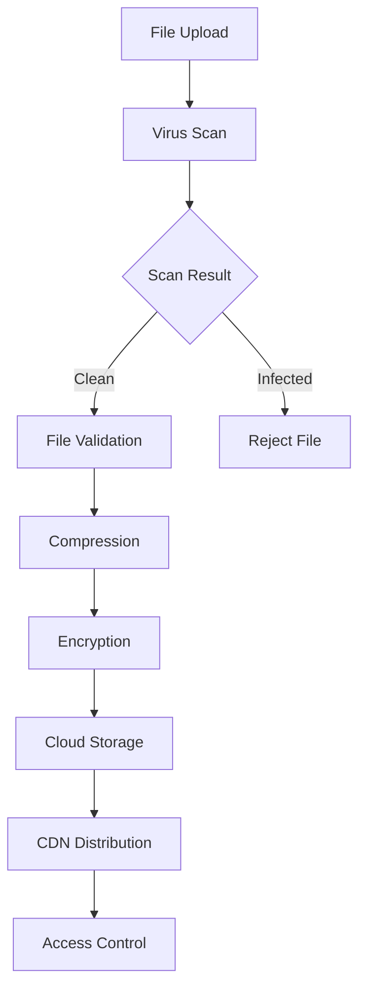
```mermaid
flowchart TD
    A[File Upload] --> B[Virus Scan]
    B --> C{Scan Result}
    C -->|Clean| D[File Validation]
    C -->|Infected| E[Reject File]
    D --> F[Compression]
    F --> G[Encryption]
    G --> H[Cloud Storage]
    H --> I[CDN Distribution]
    I --> J[Access Control]
```

## 🔄 Integration Data Flow

### External API Integration
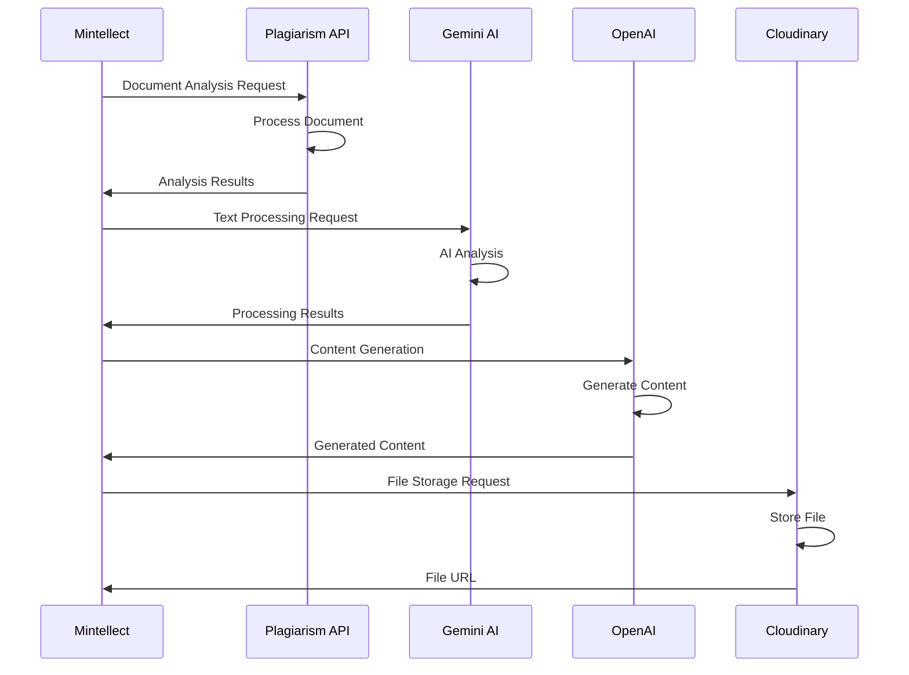
```mermaid
sequenceDiagram
    participant M as Mintellect
    participant P as Plagiarism API
    participant G as Gemini AI
    participant O as OpenAI
    participant C as Cloudinary

    M->>P: Document Analysis Request
    P->>P: Process Document
    P->>M: Analysis Results
    
    M->>G: Text Processing Request
    G->>G: AI Analysis
    G->>M: Processing Results
    
    M->>O: Content Generation
    O->>O: Generate Content
    O->>M: Generated Content
    
    M->>C: File Storage Request
    C->>C: Store File
    C->>M: File URL
```

### Webhook Integration
```mermaid
sequenceDiagram
    participant S as External Service
    participant M as Mintellect
    participant DB as Database
    participant Q as Queue

    S->>M: Webhook Event
    M->>M: Validate Webhook
    M->>Q: Add to Processing Queue
    Q->>M: Process Event
    M->>DB: Update Data
    M->>S: Webhook Response
```

## 📈 Monitoring Data Flow

### Health Check Flow
```mermaid
sequenceDiagram
    participant M as Monitoring
    participant F as Frontend
    participant B as Backend
    participant DB as Database
    participant ES as External Services

    M->>F: Health Check
    F->>M: Frontend Status
    
    M->>B: Health Check
    B->>DB: Database Check
    DB->>B: Database Status
    B->>ES: Service Check
    ES->>B: Service Status
    B->>M: Backend Status
    
    M->>M: Aggregate Health
    M->>M: Update Dashboard
```

### Logging Flow
```mermaid
flowchart TD
    A[Application Event] --> B[Log Generation]
    B --> C[Log Level Check]
    C --> D[Format Log]
    D --> E[Add Metadata]
    E --> F[Send to Logger]
    F --> G[Store in Database]
    F --> H[Send to External Service]
    G --> I[Log Analysis]
    H --> I
    I --> J[Alert Generation]
```

---

**Need more details?** Explore our [Technology Stack](../architecture/technology-stack.md) for specific implementation details, or check out our [Security](../architecture/security.md) documentation for security-specific data flows. 