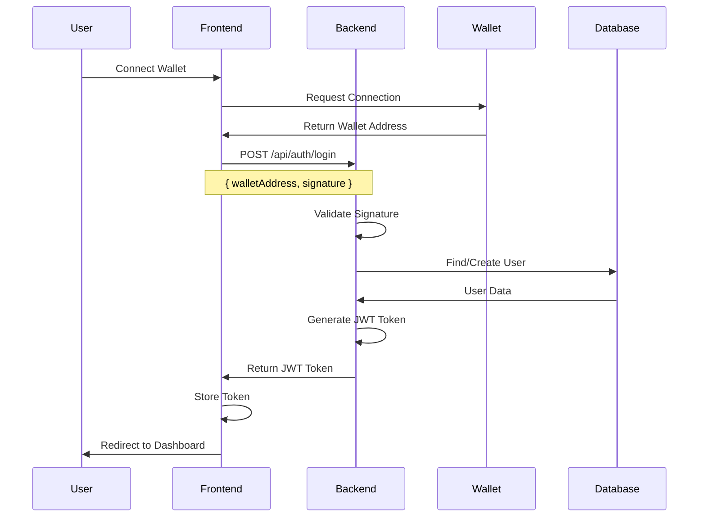
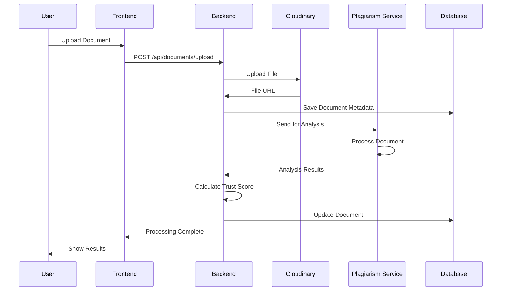
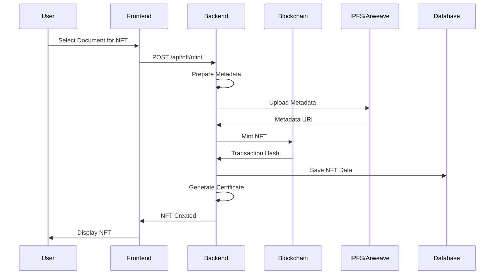

# System Design

This document provides a comprehensive overview of the Mintellect system design, including detailed architecture patterns, data flows, and technical specifications.

## 🏗️ System Architecture Overview

Mintellect is designed as a modern, scalable web application with a layered architecture that separates concerns and promotes maintainability. The system follows microservices principles while maintaining a cohesive user experience.

### Architecture Layers

```
┌─────────────────────────────────────────────────────────────────┐
│                        PRESENTATION LAYER                       │
├─────────────────────────────────────────────────────────────────┤
│  Next.js Frontend Application                                  │
│  ├── React Components (TypeScript)                             │
│  ├── State Management (SWR + React Hooks)                     │
│  ├── Routing (Next.js App Router)                              │
│  ├── UI Framework (shadcn/ui + TailwindCSS)                   │
│  └── Web3 Integration (RainbowKit + Wagmi)                    │
└─────────────────────────────────────────────────────────────────┘
                                │
                                ▼
┌─────────────────────────────────────────────────────────────────┐
│                        API GATEWAY LAYER                        │
├─────────────────────────────────────────────────────────────────┤
│  Express.js Server                                             │
│  ├── RESTful API Endpoints                                     │
│  ├── Middleware Stack (CORS, Auth, Validation)                │
│  ├── Request/Response Handling                                 │
│  ├── Error Handling & Logging                                  │
│  └── Rate Limiting & Security                                  │
└─────────────────────────────────────────────────────────────────┘
                                │
                                ▼
┌─────────────────────────────────────────────────────────────────┐
│                        BUSINESS LOGIC LAYER                     │
├─────────────────────────────────────────────────────────────────┤
│  Service Layer                                                 │
│  ├── User Management Service                                   │
│  ├── Document Processing Service                               │
│  ├── Trust Score Calculation Service                           │
│  ├── Plagiarism Detection Service                              │
│  ├── NFT Minting Service                                       │
│  └── Workflow Management Service                               │
└─────────────────────────────────────────────────────────────────┘
                                │
                                ▼
┌─────────────────────────────────────────────────────────────────┐
│                        DATA ACCESS LAYER                        │
├─────────────────────────────────────────────────────────────────┤
│  Data Persistence                                              │
│  ├── MongoDB (Primary Database)                                │
│  ├── Cloudinary (File Storage)                                 │
│  ├── Redis (Caching)                                           │
│  └── Blockchain (NFT Storage)                                  │
└─────────────────────────────────────────────────────────────────┘
```

## 🎯 Component Architecture

### Frontend Component Hierarchy

The frontend follows a hierarchical component structure that promotes reusability and maintainability:

```
App (Next.js Root)
├── Layout Components
│   ├── RootLayout
│   │   ├── ThemeProvider
│   │   ├── WalletProvider
│   │   └── Toaster
│   ├── DashboardLayout
│   │   ├── DashboardSidebar
│   │   ├── Breadcrumb
│   │   └── PageHeader
│   └── ClientLayout
│       ├── Navbar
│       ├── Footer
│       └── PageLoader
├── Navigation Components
│   ├── Navbar
│   │   ├── Logo
│   │   ├── Navigation Links
│   │   ├── User Menu
│   │   └── Wallet Connect Button
│   ├── DashboardSidebar
│   │   ├── User Profile
│   │   ├── Navigation Menu
│   │   └── Quick Actions
│   └── Breadcrumb
│       ├── Path Navigation
│       └── Page Context
├── Authentication Components
│   ├── ProfileGate
│   │   ├── Profile Completion Check
│   │   ├── Redirect Logic
│   │   └── Progress Indicator
│   ├── LoginButton
│   │   ├── Wallet Connection
│   │   ├── Authentication State
│   │   └── Error Handling
│   └── WalletConnectButton
│       ├── Wallet Selection
│       ├── Connection Status
│       └── Network Switching
├── Feature Components
│   ├── Document Management
│   │   ├── FileUpload
│   │   │   ├── Drag & Drop Interface
│   │   │   ├── File Validation
│   │   │   ├── Progress Indicator
│   │   │   └── Error Handling
│   │   ├── DocumentList
│   │   │   ├── Document Cards
│   │   │   ├── Search & Filter
│   │   │   ├── Bulk Actions
│   │   │   └── Pagination
│   │   └── DocumentViewer
│   │       ├── PDF Viewer
│   │       ├── Text Display
│   │       ├── Metadata Panel
│   │       └── Action Buttons
│   ├── Workflow Components
│   │   ├── PlagiarismWorkflow
│   │   │   ├── Upload Step
│   │   │   ├── Processing Step
│   │   │   ├── Review Step
│   │   │   └── Results Step
│   │   ├── HumanReviewInterface
│   │   │   ├── Document Display
│   │   │   ├── Review Tools
│   │   │   ├── Comment System
│   │   │   └── Decision Interface
│   │   └── WorkflowProgress
│   │       ├── Step Indicators
│   │       ├── Progress Bar
│   │       ├── Status Updates
│   │       └── Error States
│   ├── NFT Components
│   │   ├── NFTMinting
│   │   │   ├── Document Selection
│   │   │   ├── Metadata Editor
│   │   │   ├── Wallet Connection
│   │   │   └── Transaction Status
│   │   ├── NFTGallery
│   │   │   ├── NFT Grid
│   │   │   ├── Filter Options
│   │   │   ├── Search Functionality
│   │   │   └── Detail Views
│   │   └── CertificateViewer
│   │       ├── Certificate Display
│   │       ├── Verification Status
│   │       ├── Blockchain Info
│   │       └── Sharing Options
│   └── Analytics Components
│       ├── TrustScoreGenerator
│       │   ├── Score Display
│       │   ├── Factor Breakdown
│       │   ├── Recommendations
│       │   └── Historical Trends
│       ├── AnalyticsDashboard
│       │   ├── Key Metrics
│       │   ├── Performance Charts
│       │   ├── Usage Statistics
│       │   └── Export Options
│       └── Charts
│           ├── Line Charts
│           ├── Bar Charts
│           ├── Pie Charts
│           └── Heatmaps
└── UI Components (shadcn/ui)
    ├── Basic Components
    │   ├── Button
    │   ├── Input
    │   ├── Card
    │   ├── Badge
    │   └── Avatar
    ├── Interactive Components
    │   ├── Dialog
    │   ├── Modal
    │   ├── Toast
    │   ├── Tooltip
    │   └── Popover
    ├── Form Components
    │   ├── Form
    │   ├── Label
    │   ├── Textarea
    │   ├── Select
    │   └── Checkbox
    └── Animation Components
        ├── AnimatedBackground
        ├── CardHoverEffect
        ├── FlipWords
        └── TextHoverEffect
```

### Backend Service Architecture

The backend follows a modular service-oriented architecture:

```
Express.js Application
├── Middleware Stack
│   ├── CORS & Security (Helmet)
│   │   ├── Cross-Origin Resource Sharing
│   │   ├── Security Headers
│   │   ├── Content Security Policy
│   │   └── XSS Protection
│   ├── Authentication (JWT-based)
│   │   ├── Token Validation
│   │   ├── User Context
│   │   ├── Permission Checking
│   │   └── Session Management
│   ├── Profile Completion Check
│   │   ├── Required Fields Validation
│   │   ├── Redirect Logic
│   │   ├── Progress Tracking
│   │   └── User Guidance
│   ├── Request Logging
│   │   ├── Access Logs
│   │   ├── Error Logs
│   │   ├── Performance Metrics
│   │   └── Audit Trails
│   └── Error Handling
│       ├── Global Error Handler
│       ├── Validation Errors
│       ├── Database Errors
│       └── External Service Errors
├── Route Handlers
│   ├── Authentication Routes
│   │   ├── POST /api/auth/login
│   │   ├── POST /api/auth/register
│   │   ├── POST /api/auth/logout
│   │   └── GET /api/auth/profile
│   ├── User Management Routes
│   │   ├── GET /api/users/profile
│   │   ├── PUT /api/users/profile
│   │   ├── GET /api/users/settings
│   │   └── PUT /api/users/settings
│   ├── Document Routes
│   │   ├── POST /api/documents/upload
│   │   ├── GET /api/documents
│   │   ├── GET /api/documents/:id
│   │   ├── PUT /api/documents/:id
│   │   └── DELETE /api/documents/:id
│   ├── Workflow Routes
│   │   ├── POST /api/workflow/start
│   │   ├── GET /api/workflow/:id
│   │   ├── PUT /api/workflow/:id
│   │   └── GET /api/workflow/status
│   ├── Trust Score Routes
│   │   ├── POST /api/trust-score/calculate
│   │   ├── GET /api/trust-score/:id
│   │   ├── GET /api/trust-score/history
│   │   └── PUT /api/trust-score/:id
│   └── NFT Routes
│       ├── POST /api/nft/mint
│       ├── GET /api/nft/gallery
│       ├── GET /api/nft/:id
│       └── POST /api/nft/verify
├── Business Logic Services
│   ├── UserService
│   │   ├── User CRUD Operations
│   │   ├── Profile Management
│   │   ├── Settings Management
│   │   └── Authentication Logic
│   ├── DocumentService
│   │   ├── File Upload & Storage
│   │   ├── Text Extraction
│   │   ├── Metadata Management
│   │   └── Document Processing
│   ├── TrustScoreService
│   │   ├── Score Calculation
│   │   ├── Factor Analysis
│   │   ├── Recommendation Generation
│   │   └── Historical Tracking
│   ├── WorkflowService
│   │   ├── Workflow Orchestration
│   │   ├── Step Management
│   │   ├── Status Tracking
│   │   └── Error Recovery
│   └── NFTService
│       ├── Smart Contract Interaction
│       ├── Metadata Management
│       ├── Transaction Handling
│       └── Certificate Generation
└── External Service Integrations
    ├── Cloudinary (File Storage)
    │   ├── File Upload
    │   ├── Image Processing
    │   ├── CDN Delivery
    │   └── Storage Management
    ├── Plagiarism Service (Python)
    │   ├── Content Analysis
    │   ├── Similarity Detection
    │   ├── Source Verification
    │   └── Report Generation
    ├── Blockchain (Educhain)
    │   ├── Smart Contract Deployment
    │   ├── Transaction Management
    │   ├── NFT Minting
    │   └── Network Interaction
    └── AI/ML Services
        ├── Gemini AI Integration
        ├── OpenAI API Integration
        ├── Custom ML Models
        └── Text Processing
```

## 🔄 Data Flow Architecture

### User Authentication Flow

The authentication system uses wallet-based authentication with JWT tokens:



### Document Upload & Processing Flow

The document processing pipeline handles file uploads, analysis, and trust score calculation:



### NFT Minting Flow

The NFT minting process creates blockchain-based certificates:



## 🗄️ Database Architecture

### MongoDB Collections Schema

#### Users Collection
```javascript
{
  _id: ObjectId,
  walletAddress: {
    type: String,
    required: true,
    unique: true,
    index: true
  },
  profile: {
    firstName: {
      type: String,
      required: true,
      trim: true
    },
    lastName: {
      type: String,
      required: true,
      trim: true
    },
    email: {
      type: String,
      required: true,
      unique: true,
      lowercase: true
    },
    institution: {
      type: String,
      required: false
    },
    researchField: {
      type: String,
      required: false
    },
    bio: {
      type: String,
      maxlength: 500
    },
    avatar: {
      type: String,
      validate: {
        validator: function(v) {
          return /^https:\/\/res\.cloudinary\.com\//.test(v);
        }
      }
    }
  },
  settings: {
    notifications: {
      email: { type: Boolean, default: true },
      push: { type: Boolean, default: true },
      sms: { type: Boolean, default: false }
    },
    privacy: {
      profileVisibility: { type: String, enum: ['public', 'private', 'institution'], default: 'public' },
      documentVisibility: { type: String, enum: ['public', 'private', 'institution'], default: 'private' },
      allowAnalytics: { type: Boolean, default: true }
    },
    billing: {
      plan: { type: String, enum: ['free', 'basic', 'premium'], default: 'free' },
      paymentMethod: Object,
      billingAddress: Object
    }
  },
  profileComplete: {
    type: Boolean,
    default: false,
    index: true
  },
  verificationStatus: {
    type: String,
    enum: ['pending', 'verified', 'rejected'],
    default: 'pending'
  },
  createdAt: {
    type: Date,
    default: Date.now,
    index: true
  },
  updatedAt: {
    type: Date,
    default: Date.now
  }
}
```

#### Documents Collection
```javascript
{
  _id: ObjectId,
  userId: {
    type: ObjectId,
    ref: 'User',
    required: true,
    index: true
  },
  title: {
    type: String,
    required: true,
    trim: true,
    maxlength: 200
  },
  description: {
    type: String,
    maxlength: 1000
  },
  fileUrl: {
    type: String,
    required: true,
    validate: {
      validator: function(v) {
        return /^https:\/\/res\.cloudinary\.com\//.test(v);
      }
    }
  },
  fileType: {
    type: String,
    required: true,
    enum: ['pdf', 'docx', 'txt', 'rtf']
  },
  fileSize: {
    type: Number,
    required: true,
    min: 0,
    max: 52428800 // 50MB
  },
  extractedText: {
    type: String,
    required: false
  },
  trustScore: {
    overall: {
      type: Number,
      min: 0,
      max: 100,
      required: false
    },
    plagiarism: {
      type: Number,
      min: 0,
      max: 100,
      required: false
    },
    quality: {
      type: Number,
      min: 0,
      max: 100,
      required: false
    },
    relevance: {
      type: Number,
      min: 0,
      max: 100,
      required: false
    },
    details: {
      textQuality: Object,
      citationAccuracy: Object,
      methodology: Object,
      conclusions: Object
    }
  },
  plagiarismReport: {
    score: {
      type: Number,
      min: 0,
      max: 100
    },
    sources: [{
      url: String,
      title: String,
      similarity: Number,
      matchedText: String
    }],
    details: {
      totalWords: Number,
      uniqueWords: Number,
      similarityPercentage: Number,
      flaggedSections: Array
    }
  },
  status: {
    type: String,
    enum: ['pending', 'processing', 'completed', 'failed'],
    default: 'pending',
    index: true
  },
  nftMetadata: {
    tokenId: String,
    contractAddress: String,
    metadataUri: String,
    transactionHash: String,
    mintedAt: Date
  },
  tags: [String],
  visibility: {
    type: String,
    enum: ['public', 'private', 'institution'],
    default: 'private'
  },
  createdAt: {
    type: Date,
    default: Date.now,
    index: true
  },
  updatedAt: {
    type: Date,
    default: Date.now
  }
}
```

#### Workflows Collection
```javascript
{
  _id: ObjectId,
  documentId: {
    type: ObjectId,
    ref: 'Document',
    required: true,
    index: true
  },
  userId: {
    type: ObjectId,
    ref: 'User',
    required: true,
    index: true
  },
  type: {
    type: String,
    enum: ['plagiarism', 'trust-score', 'nft-minting'],
    required: true
  },
  status: {
    type: String,
    enum: ['pending', 'processing', 'completed', 'failed'],
    default: 'pending',
    index: true
  },
  steps: [{
    name: {
      type: String,
      required: true
    },
    status: {
      type: String,
      enum: ['pending', 'processing', 'completed', 'failed'],
      default: 'pending'
    },
    result: Object,
    error: String,
    startedAt: Date,
    completedAt: Date,
    duration: Number // milliseconds
  }],
  progress: {
    type: Number,
    min: 0,
    max: 100,
    default: 0
  },
  priority: {
    type: String,
    enum: ['low', 'normal', 'high'],
    default: 'normal'
  },
  retryCount: {
    type: Number,
    default: 0,
    max: 3
  },
  createdAt: {
    type: Date,
    default: Date.now,
    index: true
  },
  updatedAt: {
    type: Date,
    default: Date.now
  }
}
```

#### Trust Scores Collection
```javascript
{
  _id: ObjectId,
  documentId: {
    type: ObjectId,
    ref: 'Document',
    required: true,
    index: true
  },
  userId: {
    type: ObjectId,
    ref: 'User',
    required: true,
    index: true
  },
  score: {
    overall: {
      type: Number,
      min: 0,
      max: 100,
      required: true
    },
    plagiarism: {
      type: Number,
      min: 0,
      max: 100,
      required: true
    },
    quality: {
      type: Number,
      min: 0,
      max: 100,
      required: true
    },
    relevance: {
      type: Number,
      min: 0,
      max: 100,
      required: true
    },
    originality: {
      type: Number,
      min: 0,
      max: 100,
      required: true
    }
  },
  factors: {
    textQuality: {
      grammar: Number,
      spelling: Number,
      readability: Number,
      structure: Number
    },
    citationAccuracy: {
      properCitations: Number,
      referenceQuality: Number,
      attributionAccuracy: Number
    },
    methodology: {
      researchDesign: Number,
      dataCollection: Number,
      analysisQuality: Number
    },
    conclusions: {
      logicalFlow: Number,
      evidenceSupport: Number,
      originality: Number
    }
  },
  recommendations: [{
    category: String,
    description: String,
    priority: String,
    actionable: Boolean
  }],
  version: {
    type: String,
    default: '1.0'
  },
  algorithmVersion: {
    type: String,
    required: true
  },
  createdAt: {
    type: Date,
    default: Date.now,
    index: true
  }
}
```

## 🔒 Security Architecture

### Authentication & Authorization

The system implements a multi-layered security approach:

#### JWT Token Structure
```javascript
{
  header: {
    alg: 'HS256',
    typ: 'JWT'
  },
  payload: {
    userId: ObjectId,
    walletAddress: String,
    role: String,
    permissions: Array,
    iat: Number, // issued at
    exp: Number, // expiration
    jti: String  // JWT ID
  },
  signature: String
}
```

#### Permission System
```javascript
const permissions = {
  // Document permissions
  'documents:read': 'Read own documents',
  'documents:write': 'Create and update own documents',
  'documents:delete': 'Delete own documents',
  'documents:share': 'Share documents',
  
  // Workflow permissions
  'workflows:create': 'Create workflows',
  'workflows:read': 'Read workflow status',
  'workflows:update': 'Update workflow progress',
  
  // NFT permissions
  'nft:mint': 'Mint NFTs',
  'nft:read': 'Read NFT gallery',
  'nft:transfer': 'Transfer NFTs',
  
  // Admin permissions
  'admin:users': 'Manage users',
  'admin:documents': 'Manage all documents',
  'admin:system': 'System administration'
};
```

### Data Protection

#### Encryption Standards
- **At Rest**: AES-256 encryption for sensitive data
- **In Transit**: TLS 1.3 for all communications
- **Passwords**: bcrypt with salt rounds of 12
- **API Keys**: Encrypted before storage

#### Input Validation
```javascript
const validationSchemas = {
  documentUpload: z.object({
    title: z.string().min(1).max(200),
    description: z.string().max(1000).optional(),
    fileType: z.enum(['pdf', 'docx', 'txt', 'rtf']),
    fileSize: z.number().max(52428800), // 50MB
    visibility: z.enum(['public', 'private', 'institution'])
  }),
  
  userProfile: z.object({
    firstName: z.string().min(1).max(50),
    lastName: z.string().min(1).max(50),
    email: z.string().email(),
    institution: z.string().max(100).optional(),
    bio: z.string().max(500).optional()
  })
};
```

## 📈 Performance Architecture

### Caching Strategy

#### Redis Cache Structure
```javascript
const cacheKeys = {
  // User data caching
  userProfile: (userId) => `user:${userId}:profile`,
  userSettings: (userId) => `user:${userId}:settings`,
  
  // Document caching
  documentMetadata: (docId) => `doc:${docId}:metadata`,
  documentContent: (docId) => `doc:${docId}:content`,
  
  // Trust score caching
  trustScore: (docId) => `score:${docId}:latest`,
  trustScoreHistory: (docId) => `score:${docId}:history`,
  
  // Workflow caching
  workflowStatus: (workflowId) => `workflow:${workflowId}:status`,
  workflowProgress: (workflowId) => `workflow:${workflowId}:progress`
};
```

#### Cache TTL (Time To Live)
```javascript
const cacheTTL = {
  userProfile: 3600,        // 1 hour
  userSettings: 7200,       // 2 hours
  documentMetadata: 1800,   // 30 minutes
  documentContent: 900,     // 15 minutes
  trustScore: 3600,         // 1 hour
  workflowStatus: 300,      // 5 minutes
  sessionData: 86400        // 24 hours
};
```

### Database Optimization

#### Indexing Strategy
```javascript
// Users collection indexes
db.users.createIndex({ "walletAddress": 1 }, { unique: true });
db.users.createIndex({ "profile.email": 1 }, { unique: true });
db.users.createIndex({ "profileComplete": 1 });
db.users.createIndex({ "createdAt": -1 });

// Documents collection indexes
db.documents.createIndex({ "userId": 1 });
db.documents.createIndex({ "status": 1 });
db.documents.createIndex({ "createdAt": -1 });
db.documents.createIndex({ "trustScore.overall": -1 });
db.documents.createIndex({ "tags": 1 });

// Workflows collection indexes
db.workflows.createIndex({ "documentId": 1 });
db.workflows.createIndex({ "userId": 1 });
db.workflows.createIndex({ "status": 1 });
db.workflows.createIndex({ "type": 1 });
db.workflows.createIndex({ "createdAt": -1 });

// Trust scores collection indexes
db.trustScores.createIndex({ "documentId": 1 });
db.trustScores.createIndex({ "userId": 1 });
db.trustScores.createIndex({ "createdAt": -1 });
db.trustScores.createIndex({ "score.overall": -1 });
```

## 🔄 Integration Architecture

### External Service Integration

#### API Rate Limiting
```javascript
const rateLimits = {
  // Authentication endpoints
  '/api/auth/*': {
    windowMs: 15 * 60 * 1000, // 15 minutes
    max: 5, // 5 requests per window
    message: 'Too many authentication attempts'
  },
  
  // Document upload endpoints
  '/api/documents/upload': {
    windowMs: 60 * 60 * 1000, // 1 hour
    max: 10, // 10 uploads per hour
    message: 'Upload limit exceeded'
  },
  
  // General API endpoints
  '/api/*': {
    windowMs: 15 * 60 * 1000, // 15 minutes
    max: 100, // 100 requests per window
    message: 'Rate limit exceeded'
  }
};
```

#### Error Handling Strategy
```javascript
const errorHandlers = {
  // Database errors
  MongoError: (error) => ({
    status: 500,
    message: 'Database operation failed',
    code: 'DB_ERROR'
  }),
  
  // Validation errors
  ValidationError: (error) => ({
    status: 400,
    message: 'Validation failed',
    details: error.details,
    code: 'VALIDATION_ERROR'
  }),
  
  // Authentication errors
  JsonWebTokenError: (error) => ({
    status: 401,
    message: 'Invalid token',
    code: 'AUTH_ERROR'
  }),
  
  // External service errors
  ExternalServiceError: (error) => ({
    status: 503,
    message: 'External service unavailable',
    code: 'SERVICE_ERROR'
  })
};
```

---

**Ready to explore more?** Check out our [Data Flow](../architecture/data-flow.md) documentation for detailed information about how data moves through the system, or explore our [Technology Stack](../architecture/technology-stack.md) for specific implementation details. 